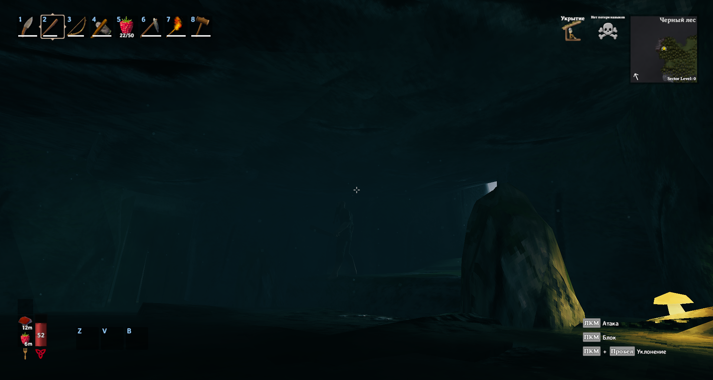
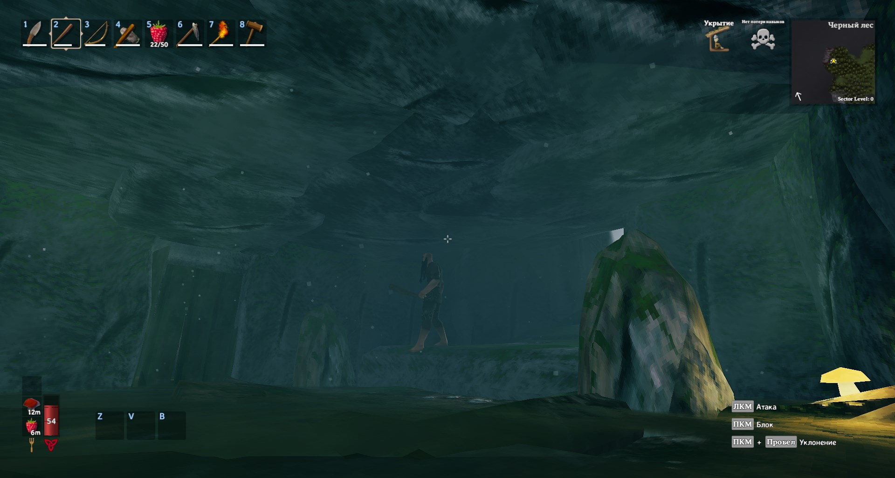
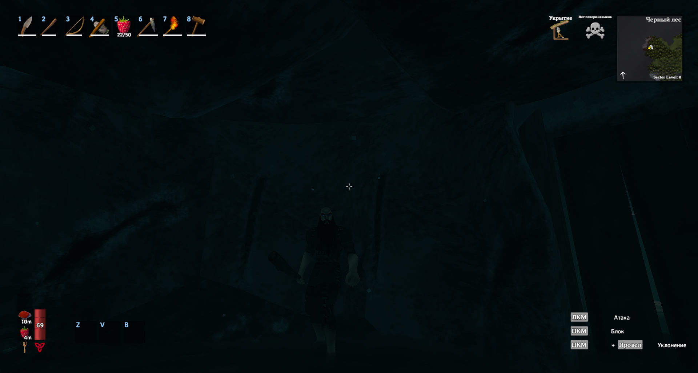
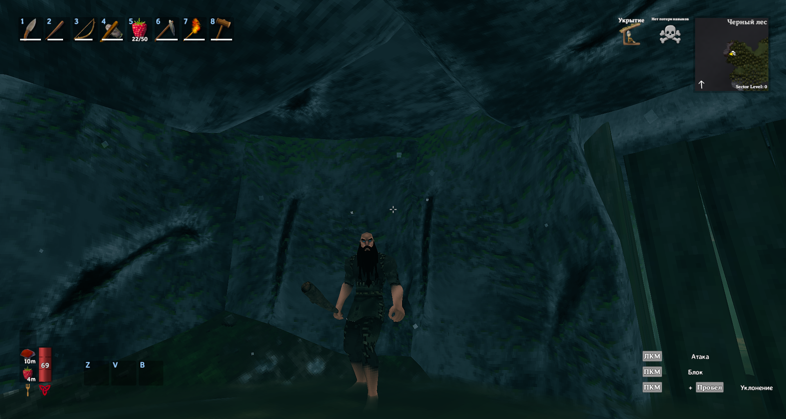
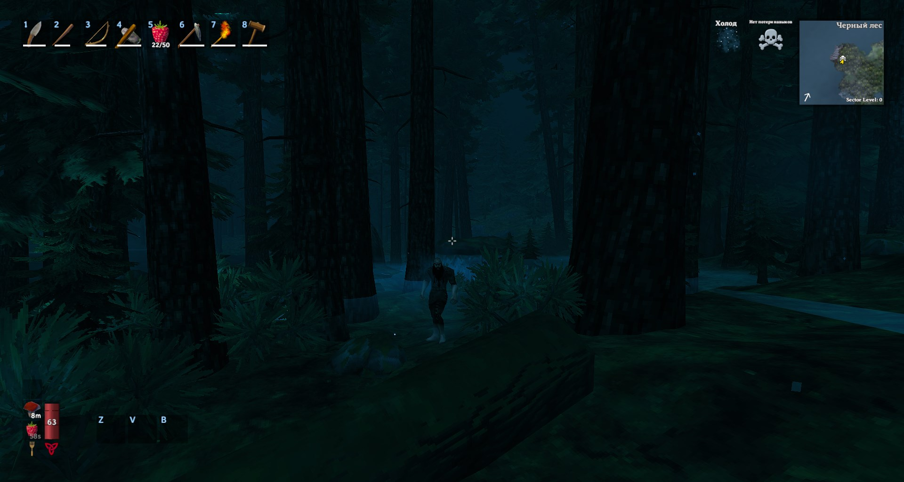
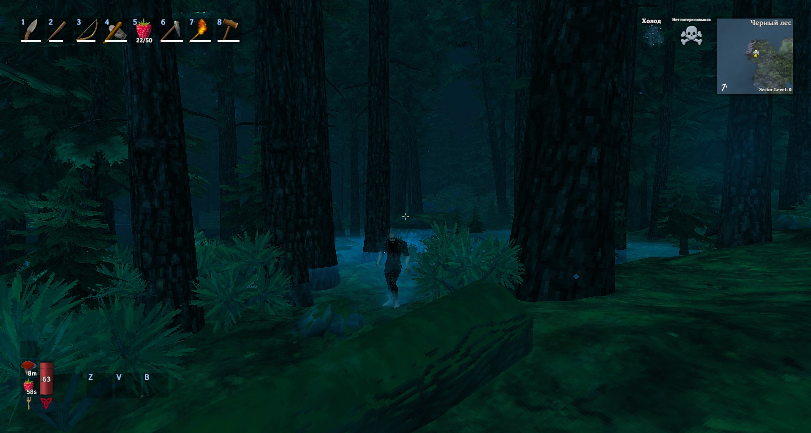
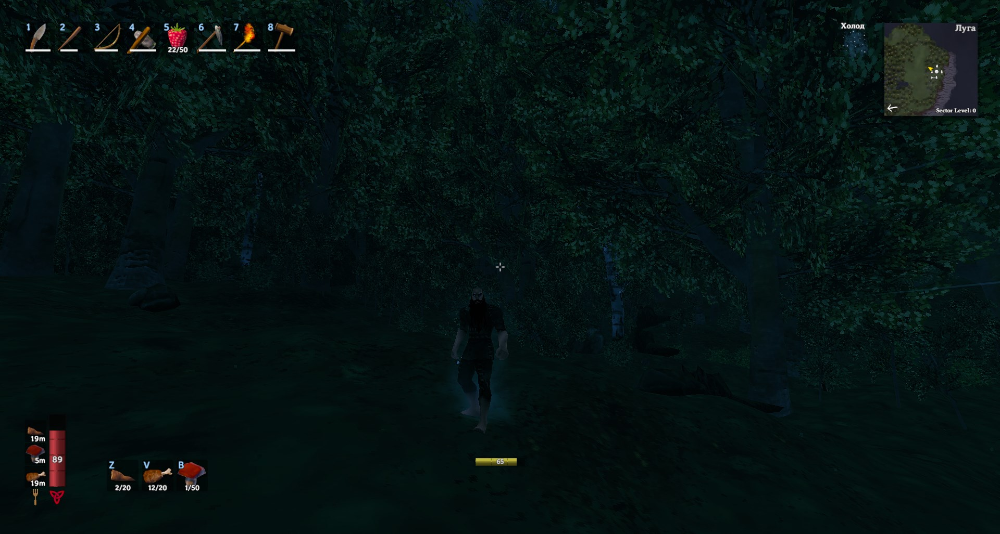
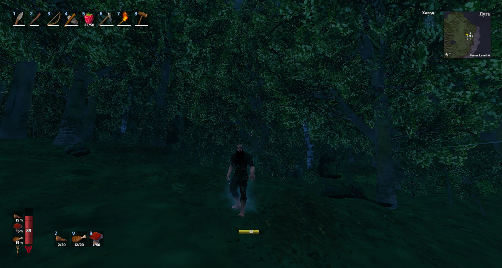

# Valheim Gamma Mod
Makes the game brighter in caves and at night.

Example (screenshots)

## How to install

Copy dll file to `BepInEx/plugins` directory. After first launch will be generated config file, where you can change brigtness of the game. Recommended to use with **ConfigurationManager** mod to tweak config without restarting game.

## Config

Settings are stored in file `BepInEx/config/ColdSpirit.GammaMod.cfg`.

**Available options**
* **ModEnabled** - in-game state of the mod
* **MinimalColorValue** - all colors will be corrected with that value before pass to **RenderSettings.ambientLight**

## How to build (vscode)

1. Rename `settings.json.template` to `settings.json` in `.vscode` directory.
1. Copy your `BepInEx/plugins` path.
1. Change `PLUGINS_DIR` path in `settings.json` to path from previous step.
1. Press `Ctrl+Shift+B` and build Release or Debug version of mod. Mod will be automatically copied to plugins directory.
1. Enjoy!

Difference between Debug and Release versions - in debug version you can decrease and increase brightness level with F4 and F6 keys, and switch enabled/disabled state with F5.
